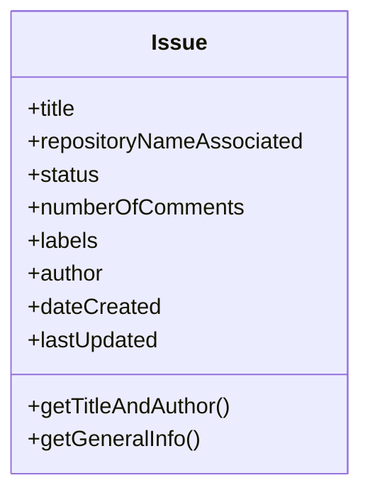

# Ejercicios

### Ejercicio 1.1 (objectIssue.js)
Modela los siguientes diagramas en objetos de JS:

```mermaid
classDiagram
    class Issue
    Issue : +title
    Issue : +repositoryNameAssociated
    Issue : +status
    Issue : +numberOfComments
    Issue : +labels
    Issue : +author
    Issue : +dateCreated
    Issue : +lastUpdated
    Issue : +getTitleAndAuthor()
    Issue : +getGeneralInfo()
```