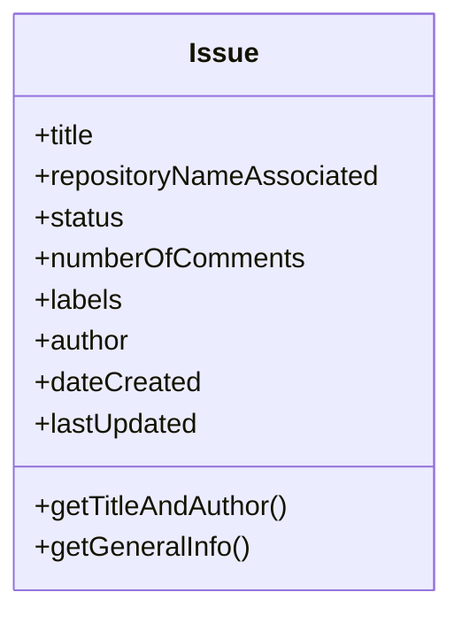
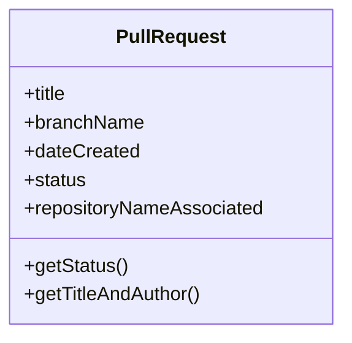
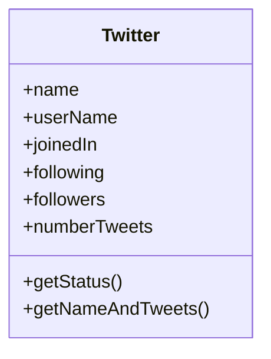

# Ejercicios

### Ejercicio 1.1 (objectIssue.js)
Modela los siguientes diagramas en objetos de JS:

---
### Ejercicio 1.2 (objectPullRequest.js)
Modela los siguientes diagramas en objetos de JS:

---
### Ejercicio 1.3 (objectTwitterUser.js)
Modela los siguientes diagramas en objetos de JS:

---
### Ejercicio 2

Toma la lista del archivo "ejercicio2.js" y realiza lo siguiente:

1. Imprime el nombre (propiedad name) de cada explorer en la lista, usa FOR EACH  
1. Imprime el stack de cada explorer, usa FOR EACH  
1. Crea una nueva lista con las listas de stacks de cada explorer, usa MAP  
1. Obtén la lista de explorers que tengan en su stack "js", usa FILTER (para validar un elemento en un lista se usa el método includes)  
1. Busca el primer explorer que sea de la CDMX, usa FIND  
1. Obtén la suma de todos los exercises_completed, usa REDUCE  
1. Obtén la validación si al menos uno de los explorers tiene la propiedad exercisesFinished en frontend como true, usa SOME  
1. Obtén la validación si todos los explorers tienen la propiedad isFinished del onboarding como true. Usa EVERY.  

---
### Ejercicio 3

Tomando de referencia el ejercicio 1, convierte esos objetos a definiciones de clases, trata de aplicar lo visto en los ejemplos. 
