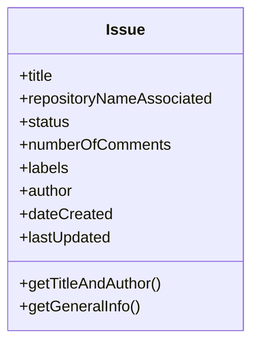
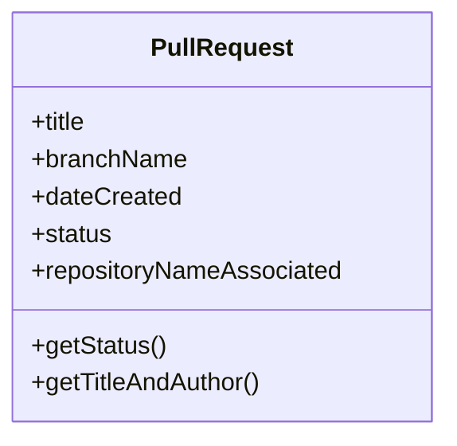
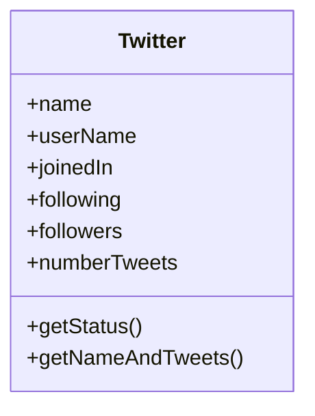

# Ejercicios

### Ejercicio 1.1 (objectIssue.js)
Modela los siguientes diagramas en objetos de JS:

---
### Ejercicio 1.2 (objectPullRequest.js)
Modela los siguientes diagramas en objetos de JS:

### Ejercicio 1.3 (objectTwitterUser.js)
Modela los siguientes diagramas en objetos de JS:

